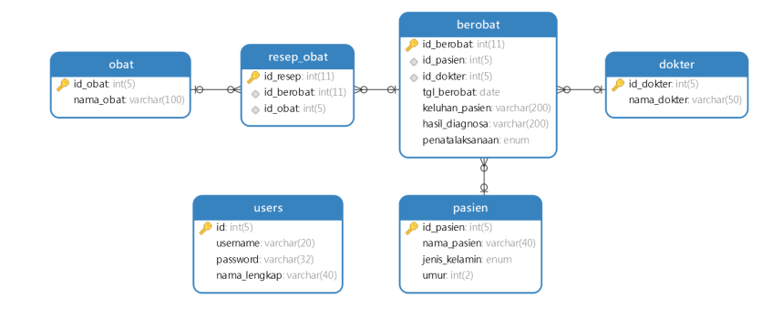
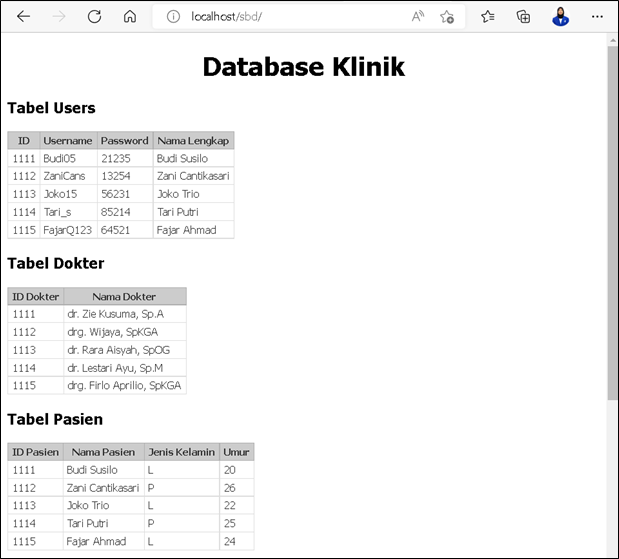
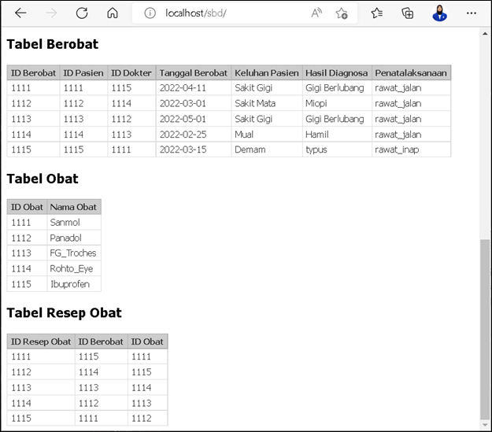

# TUGAS 5

KONEKSI DATABASE MYSQL

Soal.
1.	Menggunkan data yang dibuat dari soal Uts kemarin.
2.	Buat koneksi dengan php / bhs pemrograman lain.
3.	Tampilkan data tabelnya masing2.
4.	Buat repo di github dengan judul tugas 5 SBD 20.D2
5.	Kumpulkan link github di menu tugas 5

Jawab : 
# Desain database

            
# Screenshot

